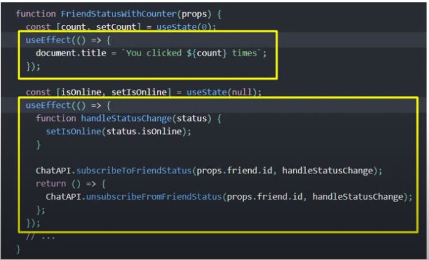

# REACT HOOKS NOTES

## 1.) useState

- The useState hook lets you add state to functional components.
- In classes, the state is always an object.
- With the useState hook, the state doesn't have to be an object.
- The useState hook returns an array with 2 elements.
- The first element is the current value of the state, and the second element is a state setter function. In the snippet below, _**count**_ is the state variable and _**setCount**_ is the setter method.

  ```js
  const [count, setCount] = useState(0);
  ```

### Using previous state with useState

- If the new state value depends on the previous state value, you can pass a function to the setter function as shown in HookCounterTwo.js and the snippet below

  ```js
  const incrementFive = () => {
    for (let i = 0; i < 5; i++) {
      // prevCount gives it access to the old value of count
      setCount((prevCount) => prevCount + 1);
    }
  };
  ```

  ### OR

  ```js
  <button onClick={() => setCount((prevCount) => prevCount + 1)}>
    Increment
  </button>
  ```

### Using useState with Objects and Arrays

- When dealing with objects or arrays, always make sure to spread your state variable and then call the setter function. This is because usState completely overwrites the state everytime it is used. Hence, if we need something from the current state, we need to copy the items from the current state first using the spread operator. This is demonstrated in _**HookCounterThree.js**_ and _**HookCounterFour.js**_. Below are some snippets demonstrating object and arrat destructuring:

  #### Array Spread Operator

  ```js
  const [items, setItems] = useState([]);

  const addItem = () => {
      // Make a copy of all the items in the array using the spread operator, 
      // then append to that array, the new object you are creating
      setItems([...items, {
          id: items.length,
          value: Math.floor(Math.random() * 10) + 1
      }])
    }
  ```

  #### Object Spread Operator

  ```js
  const [name, setName] = useState({firstName: '', lastName: ''});

  const updateFirstName = (newFirstName) => {
      setName({ ...name, firstName: newFirstName});
  }
  ```

## 2.) useEffect

- Lets you perform side effects in functional components.
- It replaces _**componentDidMount**_, _**componentDidUpdate**_ and _**componentWillUnmount**_.
- It gets executed after every render of the component.
- To use it, you simple call it and pass a callback as shown in the example below (You can also refer to _**UseEffectOne.js**_).

  ```js
  useEffect(() => {
      document.title = `You clicked ${count} times`;
  })
  ```

### Conditionally run effects example

- Running the effect after every render may cause some performance issues. To avoid this, you can compare the current value to the new value and perform the update only when they are different. To do this, you pass a second parameter to useEffect which is an array. That array is going to contain the states or props you want useEffect to depend on. Hence, the useEffect callback will be executed only when a state variable or prop specified in the array has changed. This is demonstrated below

  ```js
  const [count, setCount] = useState(0);
  const [name, setName] = useState("");

  useEffect(() => {
      console.log("useEffect - Updating document title");
      document.title = `You clicked ${count} times`;
  }, [count]);
  ```

### Run useEffect only once

- Sometimes, we want the effect to be called only once, on initial render. This can be achieved by passing an empty array as the second paramenter to the useEffect as shown below (Refer to _**HookMouse.js**_).

  ```js
  const [x, setX] = useState(0);
  const [y, setY] = useState(0);

  const logMousePosition = (mouseEvent) => {
      setX(mouseEvent.clientX);
      setY(mouseEvent.clientY);
  }

  useEffect(() => {
      console.log("useEffect called");
      window.addEventListener("mousemove", logMousePosition);
  }, [])
  ```

### Run useEffect with cleanup

- To avoid memory leaks, we need to perform cleanup code especially when dealing with event listeners. Every added event listener needs to be removed when the component is unmounted from the DOM. This can be performed by returning the cleanup code in the form of a callback function. (Refer to _**HookMouse.js**_). This is demonstrated below:

  ```js
  useEffect(() => {
      console.log("useEffect called");
      window.addEventListener("mousemove", logMousePosition);

      return () => {
          console.log("useEffect cleanup called");
          window.removeEventListener("mousemove", logMousePosition);
      };
  }, [])
  ```

### useEffect With Incorrect Dependency Array

- You need to be careful when specifying an empty dependency list. If there is any state whose value changes we want to render, make sure to add them to the dependency list of useEffect. Reffering to the code below, if we remove _**count**_ from the dependency list, it stops working because we effectively told useEffect to no track changes to count, so those changes will not be effected.

  ```js
  const [count, setCount] = useState(0);

  useEffect(() => {

      const tick = () => {
          setCount(count + 1);
      }
    
      const interval = setInterval(tick, 1000);

      return () => {
          clearInterval(interval);
      };
  }, [count]);
  ```

- Keep in mind that there are other ways to make useEffect keep track of a state variable even when it is not included in the dependency array. One of those ways is by using the useState effect in the form that tracks the previous value of the state. That will in effect force useEffect to keep track of changes to the state count (Refer to _**IntervalHookCounter.js**_).
- It also recommended to specify functions that are going to be called by useEffect within useEffect. By so doing, it decreases the likelyhood of not adding a necessary state or prop to the dependency array.

  ```js
  const [count, setCount] = useState(0);

  useEffect(() => {

      const tick = () => {
          setCount(prevCount => prevCount + 1);
      }
      
      const interval = setInterval(tick, 1000);

      return () => {
          clearInterval(interval);
      };
  }, []);
  ```

  - You can have multiple useEffect calls for different effects.  

  

### useEffect To Fetch Data From An API Endpoint

- For an example, refer to _**DataFetching.js**_

## 3.) useContext

- Use context is used when a property created in a parent component has to be passed to the child component of one of its child components. In such a situation, using useContext allows the tranfer of the property to the child property that needs it directly, without transferring it to the intermediary components which do not neccesarily need it.
- In other words, it provides a way to pass data through the component tree, without having to pass props down manually at every level.
- The first step is to create the context.

  ```js
  export const UserContext = React.createContext();
  ```

- Then, provide the context with a value, and the provider must wrap the childrn components with the value to be provided.

  ```jsx
  <UserContext.Provider value={'TestUsername'}>
      <ComponentC></ComponentC>
  </UserContext.Provider>
  ```

- Now we can consume the context value in a child component, using the renderProps pattern.

  ```jsx
  <UserContext.Consumer>
      { username => <div>User context value <b>{username}</b></div> }
  </UserContext.Consumer>
  ```

  This works for a single context, but what about multiple contexts? We will need to have a lot of nesting which complicates the code. There is a better way.

### Consuming multiple contexts using useContext

- Create the context providers, provide the values and wrap the child component in them.

  ```jsx
  <UserContext.Provider value={'TestUsername'}>
      <ChannelContext.Provider value={'CodeEvolution'}>
          <ComponentC></ComponentC>
      </ChannelContext.Provider>
  </UserContext.Provider>
  ```

- Import useContext from React
- Import the context providers into the child component where they will be consumed.
- Call the useContext hook passing on the provider context as the argument.

  ```js
  const user = useContext(UserContext);
  const channel = useContext(ChannelContext);
  ```

- Now, the data from _**UserContext**_ and _**ChannelContext**_ can be used anywhere in the consuming component, using the variables _**user**_ and _**channel**_. (Refer to _**App.js**_ and _**ComponentE.js**_)

## 4.) useReducer

- useReducer is used for state management.
- It is an alternative to useState.
- useState is built using useReducer, hence, useReducer is more primitive.
- useReducer is very similar to [_**Array.reduce**_](https://developer.mozilla.org/en-US/docs/Web/JavaScript/Reference/Global_Objects/Array/reduce) function in Javascript.
- useReducer takes 2 parameters: the _**reducer**_ which is a function and the _**initialState**_.
- The reducer function in its simplest form takes two parameters, the _**currentState**_ and an _**action**_ and returns a new state depending on the provided action.
- The action parameter dictates the transition from the currentState to the new state.
- useReducer retuns the _**newState**_ and a _**dispatch**_ which is a method used to specify the action.
- The _**dispatch**_ is used to dispatch an _**action**_ in the _**reducer**_.

  ### useReducer with simple state and simple action (Refer to [_**CounterOne.js**_](./src/components/CounterOne.js))

  ```js
  import React, { useReducer } from 'react'

  const initialState = 0;

  const reducer = (state, action) => {
      switch(action) {
          case 'increment':
              return state + 1;
          case 'decrement':
              return state - 1;
          case 'reset':
              return initialState;
          default:
              return state;
    }
  }

  function CounterOne() {
    
      const [count, dispatch] = useReducer(reducer, initialState);

      return (
        <div>
            <div>Count: {count}</div>
            <button onClick={() => dispatch('increment')}>Increment</button>
            <button onClick={() => dispatch('decrement')}>Decrement</button>
            <button onClick={() => dispatch('reset')}>Reset</button>
        </div>
      )
  }

  export default CounterOne
  ```

- Though this is more useful, the more common pattern is to have a state object which gives us maximum flexibility. (Refer to [_**CounterTwo.js**_](./src/components/CounterTwo.js))

  ### useReducer with state object

  ```js
  const initialState = {
      firstCounter: 0,
      secondCounter: 10
  };

  const reducer = (state, action) => {
    switch(action.type) {
      case 'increment':
        return { ...state, firstCounter: state.firstCounter + action.value};
      case 'decrement':
        return { ...state, firstCounter: state.firstCounter - action.value};
      case 'increment2': 
        return { ...state, secondCounter: state.secondCounter + action.value};
      case 'decrement2':
        return { ...state, secondCounter: state.secondCounter - action.value};
      case 'reset':
        return initialState;
      default:
        return state;
    }
  }

  function CounterTwo() {

    const [count, dispatch] = useReducer(reducer, initialState);

    return (
      <div>
        <div>Counter One: {count.firstCounter}</div>
        <div>Counter Two: {count.secondCounter}</div>
        <button onClick={() => dispatch({type: 'increment', value: 1})}>Increment</button>
        <button onClick={() => dispatch({type: 'increment2', value: 1})}>Increment Counter 2</button>
        <button onClick={() => dispatch({type: 'decrement', value: 1})}>Decrement</button>
        <button onClick={() => dispatch({type: 'decrement2', value: 1})}>Decrement Counter 2</button>
        <button onClick={() => dispatch({type: 'increment', value: 5})}>Increment 5</button>
        <button onClick={() => dispatch({type: 'decrement', value: 5})}>Decrement 5</button>
        <button onClick={() => dispatch({type: 'reset'})}>Reset</button>
      </div>
    )
  }
  ```

- We can also use multiple reducers to achieve the same thing effect as above. Using multiple state reducers is actually the recommended way of making changes to multiple states having the same state transitions. This is because it reduces the amount of code and the complexity of the reducer function. (Refer to [_**CounterThree.js**_](./src/components/CounterThree.js))

  ### Multiple useReducer for updating multiple states

  ```js
  const initialState = 0;

  const reducer = (state, action) => {
    switch(action) {
      case 'increment':
        return state + 1;
      case 'decrement':
        return state - 1;
      case 'reset':
        return initialState;
      default:
        return state;
    }
  }

  function CounterThree() {

    const [count, dispatch] = useReducer(reducer, initialState);
    const [countTwo, dispatchTwo] = useReducer(reducer, initialState);

    return (
      <div>
        <div>Counter One: {count}</div>
        <button onClick={() => dispatch('increment')}>Increment</button>
        <button onClick={() => dispatch('decrement')}>Decrement</button>
        <button onClick={() => dispatch('reset')}>Reset</button>
        <div>Counter Two: {countTwo}</div>
        <button onClick={() => dispatchTwo('increment')}>Increment Counter 2</button>
        <button onClick={() => dispatchTwo('decrement')}>Decrement Counter 2</button>
        <button onClick={() => dispatchTwo('reset')}>Reset Counter 2</button>
      </div>
    )
  }
  ```

- So far we have been dealing with local states. We way also want to share global state between components. This can be achieved by combining the _**useReducer**_ with _**useContext**_. (Refer to [_**App.js**_](./src/App.js), [_**UseReducerA.js**_](./src/components/UseReducerA.js), [_**UseReducerD.js**_](./src/components/UseReducerD.js), [_**UseReducerF.js**_](./src/components/UseReducerF.js))

  ### Using context API in App.js to provide the count state and dispatch to children components

  ```js
  export const CountContext = React.createContext();

  const initialState = 0;

  const reducer = (state, action) => {
    switch(action) {
      case 'increment':
        return state + 1;
      case 'decrement':
        return state - 1;
      case 'reset':
        return initialState;
      default:
        return state;
    }
  }

  function App() {

    const [count, dispatch] = useReducer(reducer, initialState);

    return (
      <div className="App">
        <CountContext.Provider value={{countState: count, countDispatch: dispatch}}>
          <UseReducerA></UseReducerA>
          <UseReducerB></UseReducerB>
          <UseReducerC></UseReducerC>
        </CountContext.Provider>
      </div>
    );
  }
  ```

  ### Consuming the global state and dispatch from parent component in child component

  ```js
  function UseReducerA() {

    const countContext = useContext(CountContext);

    return (
      <div>
        <div>Counter from A: {countContext.countState}</div>
        <button onClick={() => countContext.countDispatch('increment')}>Increment</button>
        <button onClick={() => countContext.countDispatch('decrement')}>Decrement</button>
        <button onClick={() => countContext.countDispatch('reset')}>Reset</button>
      </div>
    )
  }
  ```

- Below is an example of Date fetching with the useReducer hook. ([_**DataFetchingTwo.js**_](./src/components/DataFetchingTwo.js))

  ```js
  const initialState = {
    loading: true,
    error: '',
    post: {}
  }

  const reducer = (state, action) => {
    switch(action.type) {
      case 'FETCH_SUCCESS':
        return { ...state, loading: false, error: '', post: action.payload}
      case 'FETCH_ERROR':
        return { ...state, loading: false, error: 'Something went wrong!', post: {}}
      default:
        return state;
    }
  }

  function DataFetchingTwo() {

    const [state, dispatch] = useReducer(reducer, initialState);

    useEffect(() => {
      axios
        .get('https://jsonplaceholder.typicod.com/posts/1')
        .then(response => {
          dispatch({type: 'FETCH_SUCCESS', payload: response.data});
        })
        .catch(error => {
          dispatch({type: 'FETCH_ERROR', payload: error})
        });
    }, []);

    return (
      <div>
        { state.loading ? 'Loading' : state.post.title}
        { state.error ? state.error : null}
      </div>
    )
  }
  ```

### useReducer vs useState

Scenario | useState | useReducer  
--- | --- | ---  
**Type of State** | Number, String, Boolean | Object or Array
**Number of state transitions** | One or two | Three or more
**Related State Transitions** | No | Yes
**Business Logic** | No business logic | Complex business logic
**Local vs Global states** | Local | Global

## 5.) useCallback

- Helps with performance optimization by stopping unecessary re-renders of childrien components to which callback functions are passed as props.
- By default in a situation with multiple components sharing a common parent component, with that component passing down props which are callbacks calling the set method of a state, every time the callback is triggered, all the components will be re-rendered. This may be undesirable and in cases where it is, it results in lost performance.
- To optimize performance, we need to restrict re-rendering only to components that need to re-render.
- Using React.Memo, we can make this happen and prevent a component from re-rendering if its props or components have not changed.
- Firstly, wrap every child component export in _**React.memo**_. This fixes it to some extend but not completely because of the callback functions passed as props to children components.

  ```js
  export default React.memo(Title);
  ```

- To completely fix it, we use useCallback hook. This hook will return only a memoized version of the callback function that only changes if one of the dependencies has changed. It is useful when passing callbacks to optimized children components that rely on reference equality to prevent unnecessary renders.
- To use it, call and pass the 2 required parameters: the callback function and the dependency list.

  ```js
  const incrementAge = useCallback(() => {
    setAge(age + 1);
  }, [age]);
  ```

- In the example above, **incrementAge** can be passed as a prop to an optimized child component. (Refer to [_**ParentComponent.js**_](./src/components/ParentComponent.js), [_**Count.js**_](./src/components/Count.js), [_**Button.js**_](./src/components/Button.js))

- INTERESTING READ: [**Why it is a bad idea to use _useCallback_ all the time**](https://kentcdodds.com/blog/usememo-and-usecallback)

## 6.) useMemo

- Just like useCallback, it is used for performance optimization by preventing useless re-renders.
- Refer to the example [_**NewCounter.js**_](./src/components/NewCounter.js). 

  ```js
  function NewCounter() {

    const [counterOne, setCounterOne] = useState(0);
    const [counterTwo, setCounterTwo] = useState(0);

    const incrementOne = () => {
      setCounterOne(counterOne + 1);
    }

    const incrementTwo = () => {
      setCounterTwo(counterTwo + 1);
    }

    const isEven = () => {
      let i = 0;
      while (i < 2000000000) i++;
      return counterOne % 2 === 0;
    }

    return (
      <div>
        <div>
          <button onClick={incrementOne}>Count one - {counterOne}</button>
          <span>{isEven() ? 'Even' : 'Odd'}</span>
        </div>
        <div>
          <button onClick={incrementTwo}>Count two - {counterTwo}</button>
        </div>
      </div>
    )
  }
  ```

- Here we have two states which are rendered in the returned jsx. We also have a function to determine if the first state is odd or even and we add the while to simulate a long-running function.
- Without useMemo, even though the isEven function affects only the first counter, the same delay will be applied to the second counter as well because since the state changes, the component is re-rendered, thereby running the isEven function again even though it does not need to be.
- Using the useMemo hook, we can prevent this from happening to optimize performance.

  ```js
  function NewCounter() {

    const [counterOne, setCounterOne] = useState(0);
    const [counterTwo, setCounterTwo] = useState(0);

    const incrementOne = () => {
      setCounterOne(counterOne + 1);
    }

    const incrementTwo = () => {
      setCounterTwo(counterTwo + 1);
    }
    
    const isEven = useMemo(() => {
      let i = 0;
      while (i < 2000000000) i++;
      return counterOne % 2 === 0;
    }, [counterOne]);

    return (
      <div>
        <div>
          <button onClick={incrementOne}>Count one - {counterOne}</button>
          <span>{isEven ? 'Even' : 'Odd'}</span>
        </div>
        <div>
          <button onClick={incrementTwo}>Count two - {counterTwo}</button>
        </div>
      </div>
    )
  }
  ```

- The first parameter is the implementation of the function, and the second is the dependency list. Now, the function isEven will only be run when the state **counterone** changes. Otherwise, the memoized result will be returned. Note here that isEven is no longer a function but the value returned by the function passed as the first parameter of the useMemo hook.

## 7.) useRef

- This hook makes it possible to access DOM nodes directly within functional components and to store an immutable value.
- In the example [_**FocusInput.js**_](./src/components/FocusInput.js), the useRef hook is used to focus on a text input on page load.

  ```js
  function FocusInput() {

    const inputRef = useRef(null);

    useEffect(() => {
      // focus the input element
      inputRef.current.focus();
    }, []);

    return (
      <div>
        <input type='text' ref={inputRef}></input>
      </div>
    )
  }
  ```

- in the example below, [_**HookCounter.js](./src/components/HookCounter.js), the useRef is used to store the reference to an interval which is an immutable object. Note that the values stored in useRef persist through component re-renders.

  ```js
  const initialState = 0;

  function HookTimer() {

    const [timer, setTimer] = useState(initialState);
    const intervalRef = useRef();

    useEffect(() => {
      intervalRef.current = setInterval(() => {
        setTimer(prevTimer => prevTimer + 1);
      }, 1000);

      return () => {
        clearInterval(intervalRef.current);
      }
    }, [])

    return (
      <div>
        <div>Hook Timer - {timer}</div>
        <button onClick={() => {clearInterval(intervalRef.current)}}>Clear</button>
      </div>
    )
  }
  ```
